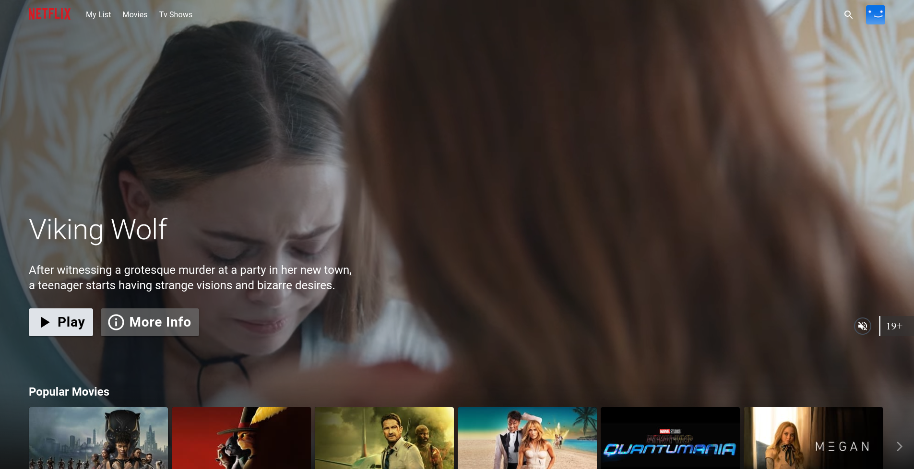
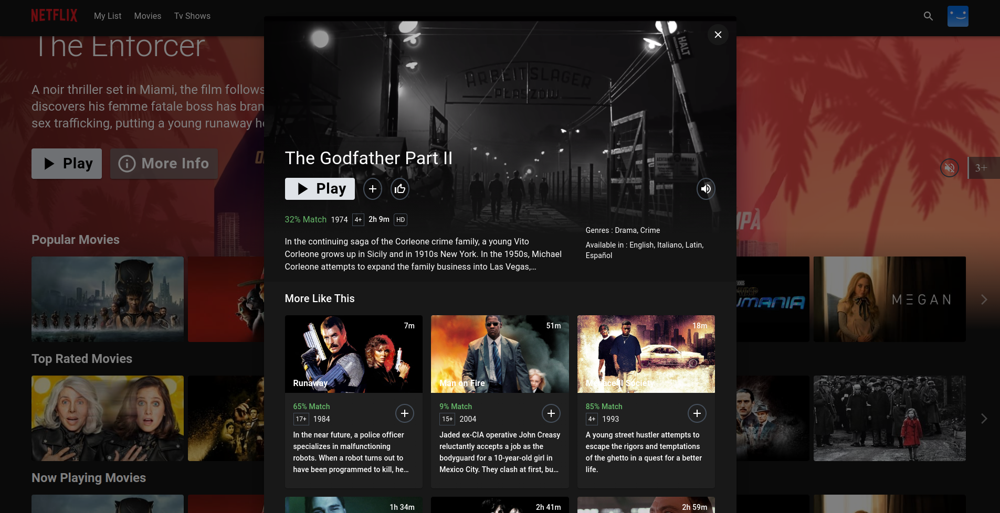
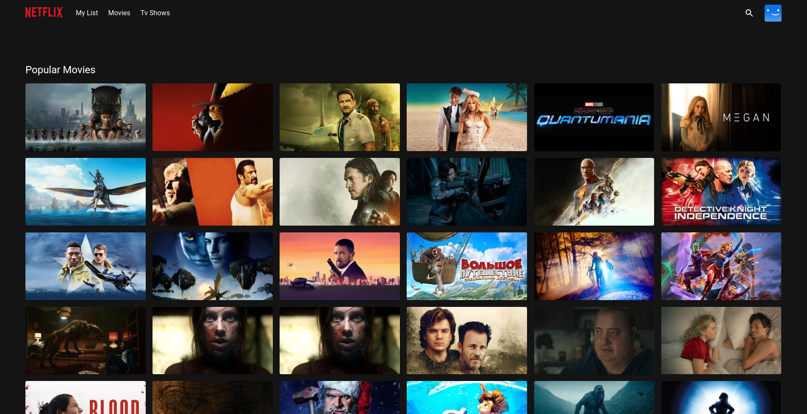

  
Table of Contents

  <ol>
    <li>
      <a href="#prerequests">Prerequests</a>
    </li>
    <li>
      <a href="#which-features-this-project-deals-with">Which features this project deals with</a>
    </li>
    <li><a href="#third-party-libraries-used-except-for-react-and-rtk">Third Party libraries used except for React and RTK</a></li>
    <li>
      <a href="#contact">Contact</a>
    </li>
  </ol>

 

  
  
Architecture

  
  
Home Page

  
  
Detail Modal

  
  
Grid Genre Page

# DevSecOps Netflix Clone 🚀

This project demonstrates a complete DevSecOps pipeline using Jenkins, SonarQube, Trivy, Docker, Prometheus, Grafana, Terraform, and AWS EKS.

---

## 🛠 Implementation Steps

### Step 1 — Launch EC2 Instance
- Ubuntu 24.04
- t2.large
- 50GB storage
- IAM Role with Admin access

### Step 2 — Install DevOps Tools
- Jenkins
- Docker
- Trivy
- SonarQube (Docker container)

### Step 3 — Generate TMDB API Key

### Step 4 — Monitoring Setup
- Install Prometheus
- Install Grafana

### Step 5 — Integrate Prometheus with Jenkins

### Step 6 — Configure Email Notifications

### Step 7 — Install Required Jenkins Plugins
- JDK
- SonarQube Scanner
- NodeJS
- OWASP Dependency Check

### Step 8 — Create Jenkins Declarative Pipeline

### Step 9 — Run OWASP Dependency Check

### Step 10 — Docker Image Build & Push

### Step 11 — Deploy Docker Container

### Step 12 — Provision AWS EKS using Terraform

### Step 13 — Access Application in Browser

### Step 14 — Terminate EC2 Instances (Cost Optimization)
